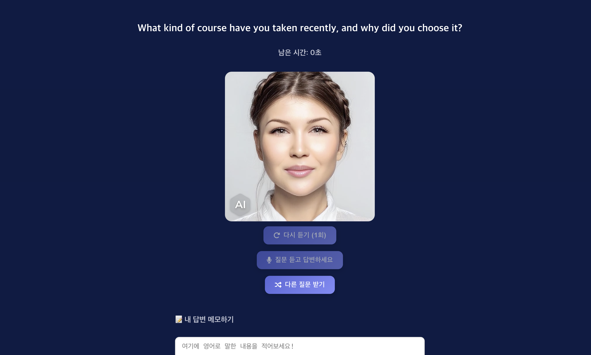
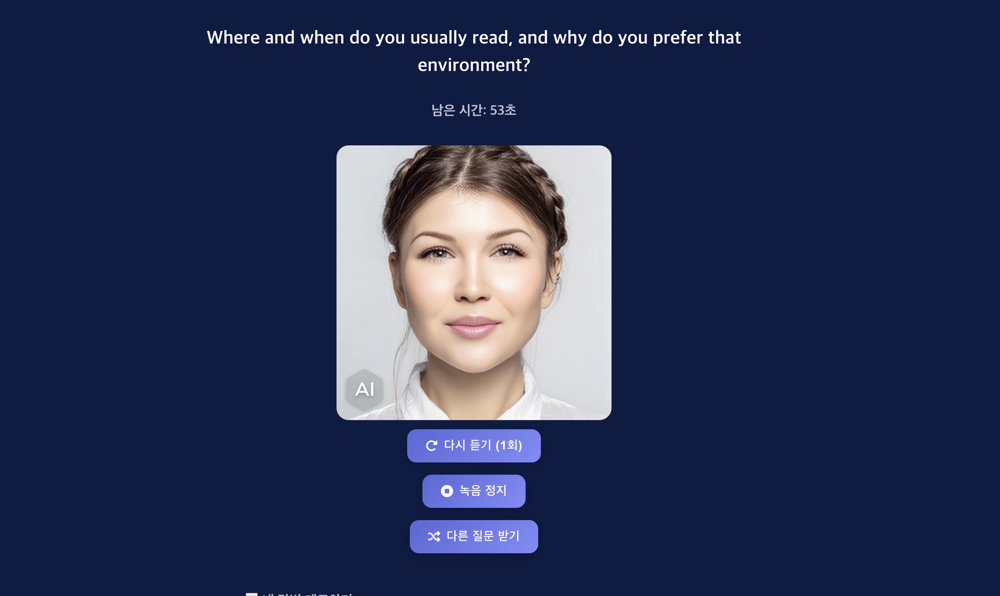
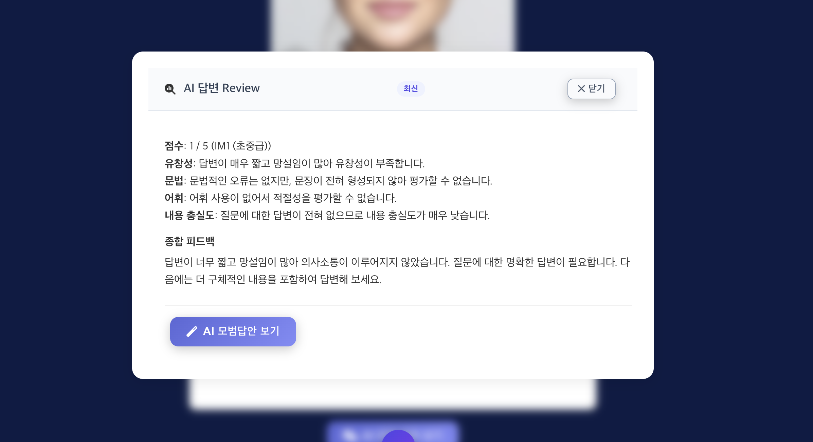
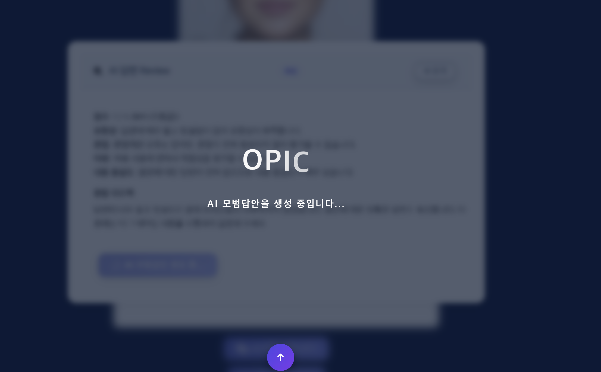
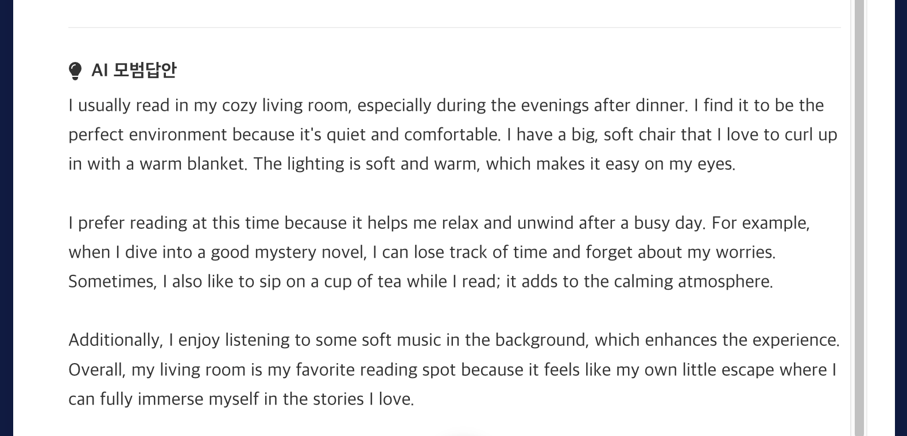
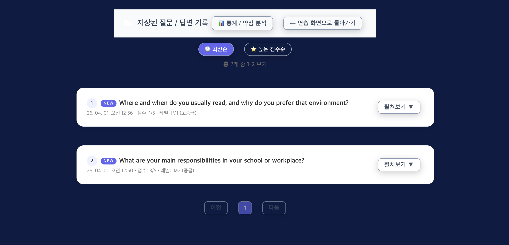

# 🎤 OPIC Master (v2)

AI 기반 OPIc(Oral Proficiency Interview) 시험 대비 웹 애플리케이션입니다.  
실제 시험과 유사한 환경에서 **아바타 영상 + 음성 합성(TTS)** 으로 질문을 제시하고,  
사용자는 **음성(STT) 또는 텍스트**로 답변할 수 있습니다.

---

## 🚀 배포 링크
- **v2 (AWS 기반 최신 버전)**: https://main.d1xbkv2kj69q3l.amplifyapp.com
- **v1 (Render + Netlify 구버전)**: https://illustrious-hummingbird-0af3bb.netlify.app

---

## 📌 주요 기능

### 학습 플로우
- **실제 OPIc 시험 흐름 구현**: Survey → 질문 제시 → 답변 녹음/텍스트 → AI 리뷰 → 저장 → 복습
- **로컬 질문 은행**: `questionBank.json` 기반 레벨/역할/거주형태 맞춤 질문 제공
- **아바타 질문 시스템**: 서버 사이드 비디오 + OpenAI TTS 음성 동기화
- **다시 듣기 (1회)**: 질문 재생 완료 후 1회 재청취 가능

### 음성 처리
- **음성 인식(STT)**: `gpt-4o-transcribe` 기반 실시간 음성 → 텍스트 변환
- **음성 합성(TTS)**: `gpt-4o-mini-tts` 기반 자연스러운 질문 읽기
- **마이크 자동 선택**: iPhone Continuity/AirPods 자동전환 방지 로직 내장

### AI 리뷰 시스템
- **LLM-as-Judge**: GPT-4o-mini 기반 4차원 자동 채점
  - 유창성 / 문법 / 어휘 / 내용 충실도
  - 점수(1~5) + 예상 레벨(IM1/IM2/IH/AL) 제공
- **교정 예시**: 교정된 영어 답변 + 수정 포인트 제안
- **AI 모범답안**: 목표 레벨 기반 모범 답변 생성

### 저장 & 복습
- **답변 저장**: 질문 + 내 답변 + AI 리뷰 + 모범답안 localStorage 저장
- **NEW 뱃지**: 24시간 이내 저장 항목 표시
- **정렬 필터**: 최신순 / 높은 점수순 정렬
- **페이지네이션**: 10개 단위 페이지 처리
- **통계 / 약점 분석**: 저장된 리뷰 데이터 기반 분석 화면

### 성능
- **콜드스타트 완화**: Keep-Alive 에이전트 + warm-up 요청으로 첫 응답 지연 최소화
- **In-Memory TTS 캐시**: 동일 문장 TTS 재요청 시 즉시 응답 (1시간 TTL)

---

## 🖼 화면 미리보기

### 메인 화면


### OPIC Survey 화면


### 질문 화면


### 녹음 중


### AI 답변 리뷰


### AI 모범답안 생성 중


### AI 모범답안


### 저장된 기록 (NEW 뱃지 + 정렬 필터)


---

## 🛠 기술 스택

### Frontend
- React.js (Hooks 기반)
- Web Audio API + MediaRecorder (녹음)
- localStorage (답변 히스토리 저장)
- UI: Custom CSS + FontAwesome

### Backend
- Node.js (Express, ESM)
- OpenAI API
  - `gpt-4o-mini` (질문 생성, 모범답안, AI 리뷰)
  - `gpt-4o-mini-tts` (음성 합성)
  - `gpt-4o-transcribe` (음성 인식)
- multer (파일 업로드)
- node-fetch + Keep-Alive (지연 최소화)

### Infra
- Frontend: AWS Amplify
- Backend: AWS App Runner

---

## 📂 프로젝트 구조

```bash
OPIC-AI-TRAINER/
├─ backend/
│  ├─ server.js               # Express API 서버
│  ├─ videos/                 # 아바타 질문 영상 (.mp4)
│  ├─ .env                    # 환경 변수 (git 제외)
│  └─ package.json
│
└─ frontend/
   ├─ public/
   │  ├─ favicon.ico
   │  ├─ index.html
   │  └─ robots.txt
   │
   └─ src/
      ├─ App.js               # 메인 라우팅 (start/survey/practice/review/stats)
      ├─ App.css
      ├─ components/
      │  ├─ Practice.js       # 질문 제시 + 녹음 + AI 리뷰
      │  ├─ Review.js         # 저장 답변 복습 (정렬/페이지네이션)
      │  ├─ Survey.js         # 레벨/역할/토픽 설정
      │  ├─ Stats.js          # 통계 & 약점 분석
      │  ├─ LoadingOverlay.js
      │  └─ ScrollButtons.js
      └─ data/
         └─ questionBank.json # 로컬 질문 은행
```

---

## 💡 향후 개선 계획
- **Heygen API 연동**: 아바타가 실제로 말하는 인터랙티브 환경 (구현 완료, 유료 결제 필요로 배포 미적용)
- **MongoDB 연동**: 서버 기반 답변 저장으로 기기 간 동기화
- **사용자 계정 시스템**: 개인별 연습 기록 관리
- **스트리밍 TTS**: 첫 응답 지연 최소화 및 몰입도 강화
- **RAG 기반 질문 생성**: 사용자 약점 기반 맞춤 질문 자동 생성

---

## 📜 라이선스
MIT License