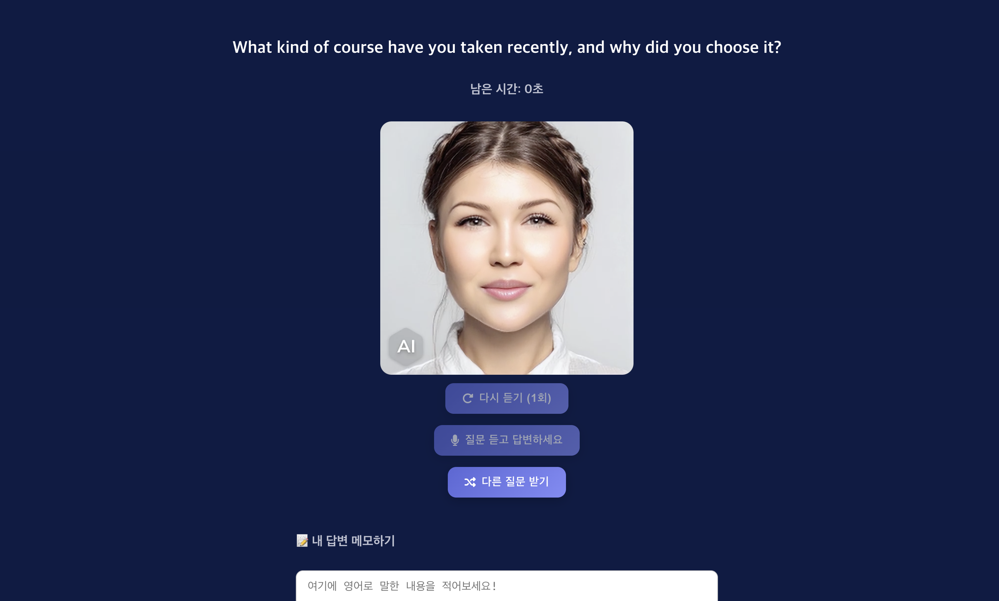
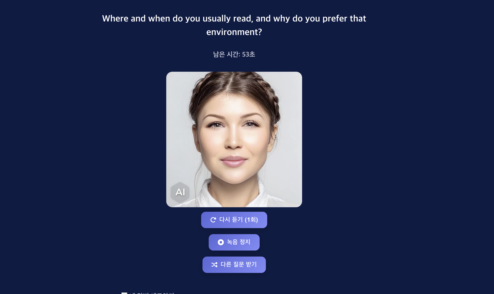
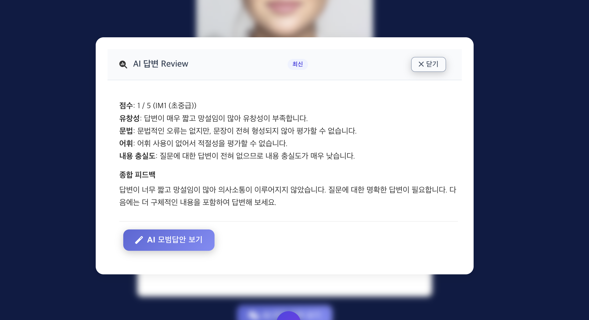
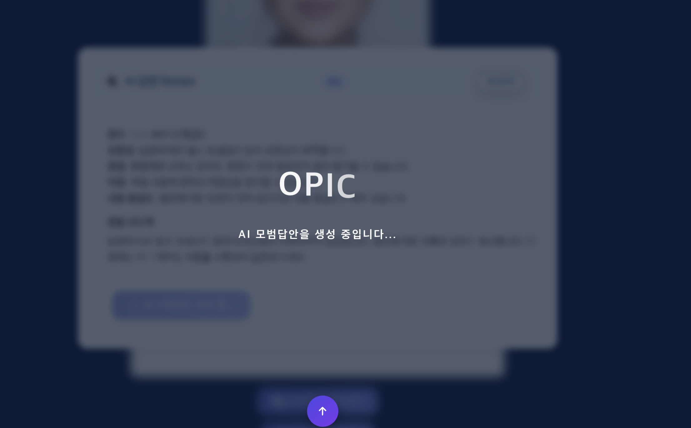
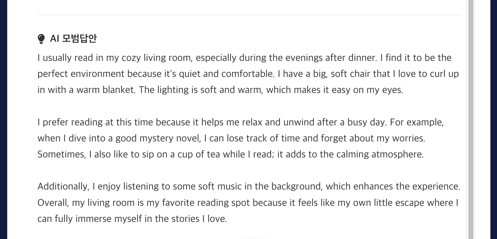
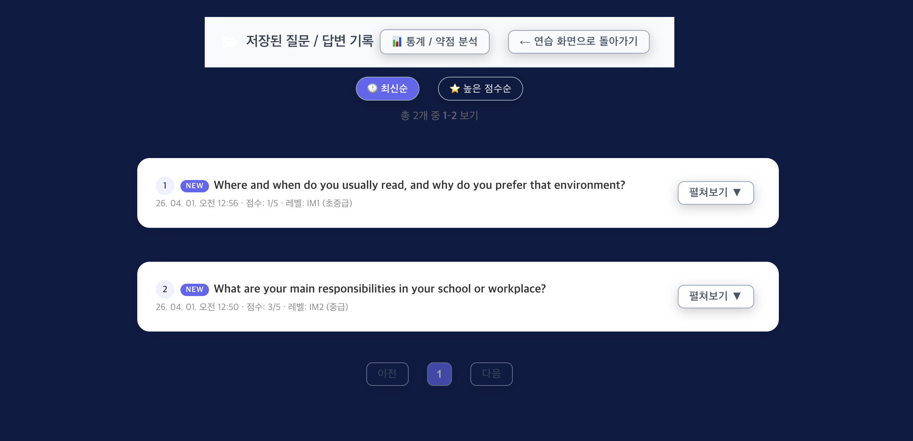

# 🎤 OPIC Master (v3)

AI 기반 OPIc(Oral Proficiency Interview) 시험 대비 웹 애플리케이션입니다.  
실제 시험과 유사한 환경에서 **아바타 영상 + 음성 합성(TTS)** 으로 질문을 제시하고,  
사용자는 **음성(STT) 또는 텍스트**로 답변할 수 있습니다.

---

## 🚀 배포 링크
- **v3 (현재, AWS Amplify)**: https://main.d1xbkv2kj69q3l.amplifyapp.com
- **v1 (Render + Netlify 구버전)**: https://illustrious-hummingbird-0af3bb.netlify.app

---

## 🕰 버전 히스토리

이 프로젝트는 3번의 리팩토링을 거쳤습니다. 각 버전은 실제 운영 제약(비용·속도)에 따라
의도적으로 구조를 바꾼 결과입니다.

| 버전 | 시기 | 질문 전달 | STT | 비고 |
|---|---|---|---|---|
| [v1](https://github.com/lifeiscabaret/opic-practice) | 2025.06 | 텍스트만 | Whisper (`whisper-1`) | GPT로 질문 즉석 생성 |
| [v2](https://github.com/lifeiscabaret/opic-ai-trainer) | 2025.07 | D-ID 아바타 실시간 음성 | - | 실전감 강화, but API 비용 급증 |
| **v3 (현재)** | 2025.08 | D-ID 사전 생성 영상 + 로컬 질문은행 | `gpt-4o-transcribe` | 비용 절감 + 응답속도 개선 |

**왜 바꿨는지**: D-ID 실시간 호출은 질문마다 비용이 발생해 확장성이 없다고 판단,
54문항을 사전 생성해 질문은행화하고 캐싱했습니다.

**STT 이전 경로**: v1([opic-practice](https://github.com/lifeiscabaret/opic-practice))의
음성 인식(STT)은 브라우저가 OpenAI `whisper-1`을 **직접 호출**하는 클라이언트 사이드 방식이라
API 키가 프론트에 노출되는 구조였습니다. v3에서는 이 STT 로직을 **백엔드 `/stt` 프록시
(`gpt-4o-transcribe`)로 이전**하여 키를 서버에서 관리하고 모델도 최신화했습니다.
즉, 레거시 레포에 남아 있는 STT 관련 코드는 현재 백엔드(`opic-backend`) 기준으로 대체된 상태입니다.

---

## 📌 주요 기능

### 학습 플로우
- **실제 OPIc 시험 흐름 구현**: Survey → 질문 제시 → 답변 녹음/텍스트 → AI 리뷰 → 저장 → 복습
- **로컬 질문 은행**: `questionBank.json` 기반 레벨/역할/거주형태 맞춤 질문 제공
- **아바타 질문 시스템**: D-ID로 사전 생성한 아바타 영상(음성 포함)을 백엔드에서 서빙 (`/video/:id`)
- **다시 듣기 (1회)**: 질문 재생 완료 후 1회 재청취 가능

### 음성 처리
- **음성 인식(STT)**: `gpt-4o-transcribe` 기반 녹음 답변 → 텍스트 변환
- **질문 음성**: v3는 D-ID 사전 생성 영상의 음성을 사용(실시간 TTS 호출 없음). 백엔드에 `gpt-4o-mini-tts` 기반 `/tts` 엔드포인트가 남아 있어 텍스트 질문 음성화에 재사용 가능
- **마이크 자동 선택**: iPhone Continuity/AirPods 자동전환 방지 로직 내장

### AI 리뷰 시스템
- **LLM-as-Judge**: GPT-4o-mini 기반 4차원 자동 채점
  - 유창성 / 문법 / 어휘 / 내용 충실도
  - 점수(1~5) + 예상 레벨(IM1/IM2/IH/AL) 제공
- **AI 모범답안**: 목표 레벨 기반 모범 답변 생성 (`/ask`, 130–170단어 spoken style)

### 저장 & 복습
- **답변 저장**: 질문 + 내 답변 + AI 리뷰 + 모범답안 localStorage 저장
- **NEW 뱃지**: 24시간 이내 저장 항목 표시
- **정렬 필터**: 최신순 / 높은 점수순 정렬
- **페이지네이션**: 10개 단위 페이지 처리
- **통계 / 약점 분석**: 저장된 리뷰 데이터 기반 분석 화면

### 성능
- **콜드스타트 완화**: 앱 시작 시 백엔드 헬스체크 warm-up(최대 3회 재시도)으로 첫 응답 지연 완화 (Keep-Alive 에이전트는 백엔드 측)
- **In-Memory 미디어 스토어**: 백엔드가 TTS 오디오를 메모리에 1시간 TTL로 보관하고 Range 스트리밍으로 서빙

---

## 🖼 화면 미리보기

### 메인 화면


### OPIC Survey 화면


### 질문 화면


### 녹음 중


### AI 답변 리뷰


### AI 모범답안 생성 중


### AI 모범답안


### 저장된 기록 (NEW 뱃지 + 정렬 필터)


---

## 🛠 기술 스택

### Frontend
- React.js (Hooks 기반)
- Web Audio API + MediaRecorder (녹음)
- localStorage (답변 히스토리 저장)
- UI: Custom CSS + FontAwesome

### Backend
- Node.js (Express, ESM)
- OpenAI API
  - `gpt-4o-mini` (AI 리뷰, 모범답안 생성) — v1에서는 질문 즉석 생성에도 사용
  - `gpt-4o-mini-tts` (음성 합성)
  - `gpt-4o-transcribe` (음성 인식)
- multer (파일 업로드)
- node-fetch + Keep-Alive (지연 최소화)

### Infra
- Frontend: AWS Amplify
- Backend: AWS App Runner

---

## 📂 프로젝트 구조

```bash
OPIC-AI-TRAINER/
├─ backend/
│  ├─ server.js               # Express API 서버
│  ├─ videos/                 # 아바타 질문 영상 (.mp4)
│  ├─ .env                    # 환경 변수 (git 제외)
│  └─ package.json
│
└─ frontend/
   ├─ public/
   │  ├─ favicon.ico
   │  ├─ index.html
   │  └─ robots.txt
   │
   └─ src/
      ├─ App.js               # 메인 라우팅 (start/survey/practice/review/stats)
      ├─ App.css
      ├─ components/
      │  ├─ Practice.js       # 질문 제시 + 녹음 + AI 리뷰
      │  ├─ Review.js         # 저장 답변 복습 (정렬/페이지네이션)
      │  ├─ Survey.js         # 레벨/역할/토픽 설정
      │  ├─ Stats.js          # 통계 & 약점 분석
      │  ├─ LoadingOverlay.js
      │  └─ ScrollButtons.js
      └─ data/
         └─ questionBank.json # 로컬 질문 은행
```

---

## 💡 향후 개선 계획
- **교정 답변/수정 포인트**: 리뷰 모달 UI는 구현되어 있으나, 백엔드 `/review` 응답에 `correctedAnswer`·`correctionTips` 필드 추가 필요 (현재는 4차원 피드백+점수+레벨만 반환)
- **Heygen API 연동**: 아바타가 실제로 말하는 인터랙티브 환경 (구현 완료, 유료 결제 필요로 배포 미적용)
- **MongoDB 연동**: 서버 기반 답변 저장으로 기기 간 동기화
- **사용자 계정 시스템**: 개인별 연습 기록 관리
- **스트리밍 TTS**: 첫 응답 지연 최소화 및 몰입도 강화
- **RAG 기반 질문 생성**: 사용자 약점 기반 맞춤 질문 자동 생성

---

## 📜 라이선스
MIT License